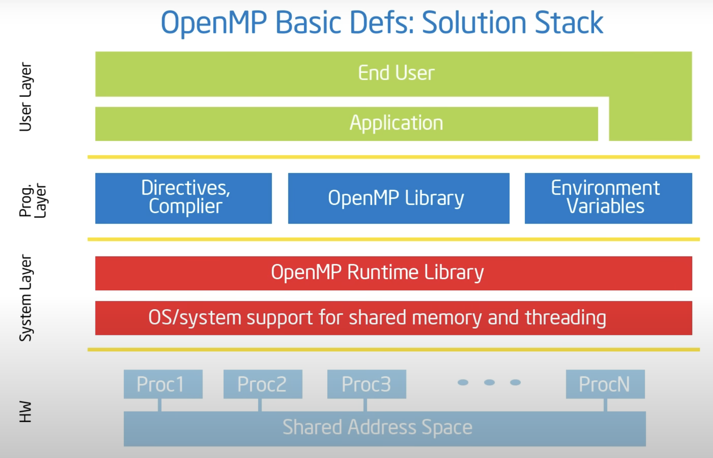

+++
title = 'OpenMP101 - 01: Basic Concepts and Introduction'
date = 2024-01-29T17:30:00+08:00
draft = false

series = ['OpenMP101']
categories = ['Parallel-Computing']
tags = ['HPC', 'OpenMP', 'Parallel-Computing']

+++

## Basic Concepts

### Concurrency vs Parallelism

* **Concurrency**: A condition of a system in which multiple tasks are *logically* active at one time.
* **Parallelism**: A condition of a system in which multiple tasks are *actually* active at one time.
* Parallel programs is a subset of concurrent programs.

* **Concurrent Application**: an application for which computations *logically* execute simultanneously due to the semantics of the applcition. 
  * The problem is fundamentally concurrent.
* **Parallel Application**: an application for which the computations *actually* execute simultaneously in rder to complete a problem in less time.
  * The problem doesn't inherently require concurrency, you can state it sequentially.

## OpenMP

* An API for writing multithreaded applications.
* A set of compiler directives and library routines for parallel application programmers. 
* **OpenMP is only used as the last step for parallelize the application, it is still the programmer's job to first understand code strategy and identify areas that can be optimized.**

### OpenMP Solution Stack 



(Source: Tim Mattson (Intel))

### Core Syntax

Most of the constructs in OpenMP are compiler directives followed by function prototypes and types in the file: 

```c
#pragma omp construct [clause[clause]...]
```

For example: 

```c
#pragma omp parallel for reduction
for (;;) {
  ...
}
```

#### Scope

Most OpenMP constructs apply to a "**Structured Block**": a block of one or more statements with one point of entry at the top and one point of exit at the bottom. For example, a for loop, while loop, curely braces surrounded code blocks.

